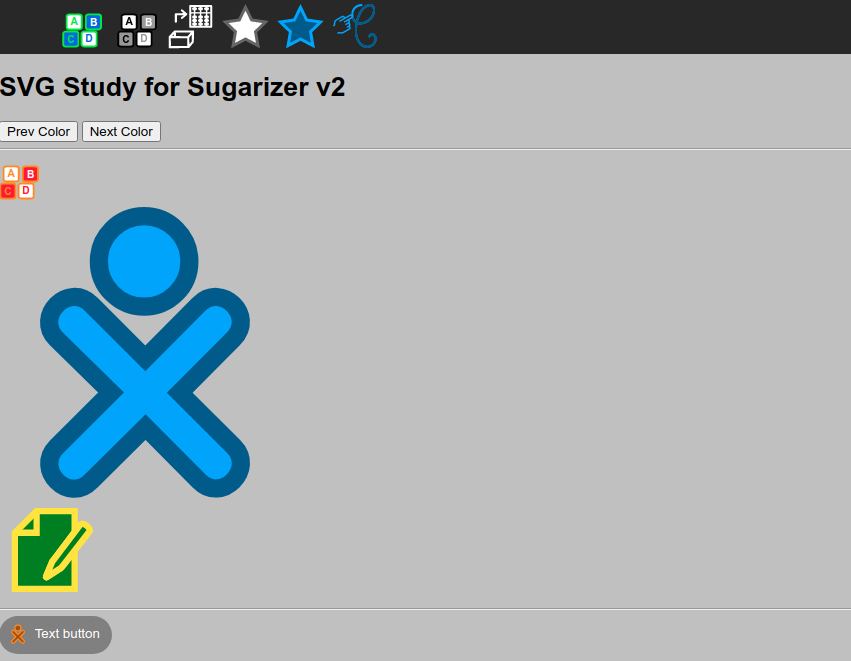

# SVG Study for Sugarizer v2

The idea of this study is to simplify handling of coloured SVG file in Sugarizer.



## How coloured SVG file works in Sugarizer v1

The current SVG coloured system in Sugarizer v1 is inherited from Sugar. The format used is described [here](https://wiki.sugarlabs.org/go/Development_Team/Almanac/Making_Icons). With this mechanism, to be able to color a SVG file in Sugarizer:

- The SVG file must include a specific `DOCTYPE` header. This header is used to declare `stroke_color` and `fill_color` attribute as XML Entity. For example:

```
<!DOCTYPE svg PUBLIC "-//W3C//DTD SVG 1.1//EN" "http://www.w3.org/Graphics/SVG/1.1/DTD/svg11.dtd" [
	<!ENTITY stroke_color "#000000">
	<!ENTITY fill_color "#999999">
]>
```

- These `stroke_color` and `fill_color` attributes must be referenced in the SVG file in any place where a color could be changed. For example:

```
<rect
   style="fill:&fill_color;;fill-opacity:1;stroke:&stroke_color;;stroke-width:2.20000004999999990;stroke-miterlimit:4;stroke-opacity:1;stroke-dasharray:none;stroke-dashoffset:0"
   id="rect2987"
   width="17.67767"
   height="17.67767"
   x="10.101525"
   y="1010.6934"
   rx="4.22753"
   ry="2.0411496" />
```

- The SVG file must be use as background image for the element (button, icon, ...). For example:

```
#main-toolbar #activity-button {
  background-image: url(activity/activity-icon.svg);
}
```

- The function `colorize(elem,colors,callback)` in `sugar-web/graphics/icon` module must be call to change SVG color. This function:

    * Load the background SVG file of the `elem` element by using a `XMLHttpRequest` call
    * Replace values of `<!ENTITY stroke_color ...>` and `<!ENTITY fill_color ...>` in the header of the file by parameter values `colors.stroke` and `colors.fill`
    * Generate a memory image with this new content prefixed by `data:image/svg+xml,`
    * Change the background of the `elem` element with the value of the memory image HTML encoded. For example:

```
url("data:image/svg+xml,%3C%3Fxml%20version%3D%221.0%22%20encoding%3D%22UTF-8%22%20standalone%3D%22no%22%3F%3E%0A%3C%21DOCTYPE
%20svg%20PUBLIC%20%22-//W3C//DTD%20SVG%201.1//EN%22%20%22http%3A//www.w3.org/Graphics/SVG/1.1/DTD/svg11.dtd%22%20%5B%0A%09%3C%21
ENTITY%20stroke_color%20%22%2300B20D%22%3E%0A%09%3C%21ENTITY%20fill_color%20%22%23FF8F00%22%3E%0A%5D%3E%0A%3Csvg%0A%20%20%20
xmlns%3Adc%3D%22http%3A//purl.org/dc/elements/1.1/%22%0A%20%20%20xmlns%3Acc%3D%22http%3A//creativecommons.org/ns%23%22%0A%20%20
%20xmlns%3Ardf%3D%22http%3A//www.w3.org/1999/02/22-rdf-syntax-ns%23%22%0A%20%20%20xmlns%3Asvg%3D%22http%3A//www.w3.org/2000/svg
%22%0A%20%20%20xmlns%3D%22http%3A//www.w3.org/2000/svg%22%0A%20%20%20xmlns%3Asodipodi%3D%22http%3A//sodipodi.sourceforge.net/DTD/
...%3C/tspan%3E%3C/text%3E%0A%20%20%3C/g%3E%0A%3C/svg%3E%0A")
```

## Drawback of current way of working

The current system works but have several drawbacks:

* The SVG file should be reloaded each time it need to be recolored. It means that each icon in the UI is load - at least - one time without color and another time to change its colors
* Using of `XmlHttpRequest` call prevent browser caching
* Using encoded DATA image as background has performance issue
* Using of `XmlHttpRequest` call on `file:///` is forbidden by default in recent browsers
* The SVG file should be updated manually: no editor support the add of a new section and using of attributes as XML Entity

## Handling SVG files in Sugarizer v2

The idea in Sugarizer v2 is to handle SVG files using only native SVG features, specifically: [CSS variables](https://developer.mozilla.org/en-US/docs/Web/CSS/--*), [CSS in SVG](http://tutorials.jenkov.com/svg/svg-and-css.html) and [SVG external source](https://css-tricks.com/svg-use-with-external-reference-take-2/).

* CSS variables is a way to define custom CSS properties that you could add to standard CSS properties. In Sugarizer v2 we will define two new custom properties `--stroke-color` and `--fill-color`. These properties will be use to match stroke color and fill color to use in the SVG. We will also define a list of CSS class to match all possible XO buddy colors. Something like:

```
.xo-color0 { --stroke-color: #B20008; --fill-color: #FF2B34; }
.xo-color1 { --stroke-color: #FF2B34; --fill-color: #B20008; }
.xo-color2 { --stroke-color: #E6000A; --fill-color: #FF2B34; }
.xo-color3 { --stroke-color: #FF2B34; --fill-color: #E6000A; }
.xo-color4 { --stroke-color: #FFADCE; --fill-color: #FF2B34; }
.xo-color5 { --stroke-color: #9A5200; --fill-color: #FF2B34; }
.xo-color6 { --stroke-color: #FF2B34; --fill-color: #9A5200; }
...
```


* CSS in SVG is a way to reference CSS classes and properties in a SVG file. So we could use our new CSS custom properties directly in a SVG embedded in HTML. Something like:


```
<svg
   width="55"
   height="55"
   class="xo-color3"
>
<rect
   style="fill:var(--fill-color);fill-opacity:1;stroke:var(--stroke-color);stroke-width:2.20000004999999990;stroke-miterlimit:4;stroke-opacity:1;stroke-dasharray:none;stroke-dashoffset:0"
   id="rect2987"
   width="17.67767"
   height="17.67767"
   x="10.101525"
   y="1010.6934"
   rx="4.22753"
   ry="2.0411496" />
```

* SVG external source allow to reference and external SVG file into a DOM element. It's a way to include an SVG file like if it was directly in the code. We need to use the `use` tag and the `xlink:href` attribute. Something like:

```
<svg class="xo-color3">
   <use xlink:href="my-icon.svg#icon" />
</svg>
```

For Sugarizer v2, we will dynamically generate the new SVG element with a bunch of code like this:

```
   var svgElement = document.createElementNS("http://www.w3.org/2000/svg", "svg");
   svgElement.setAttribute("class", "xo-color3");
   var useElement = document.createElementNS(svgElement.namespaceURI,"use");
   useElement.setAttribute("xlink:href","my-icon.svg#icon");
   useElement.setAttribute("href",my-icon.svg#icon"); // Need on some browsers
   svgElement.appendChild(useElement);
   document.body.appendChild(svgElement);
``` 

Note that using SVG external source require to reference a `symbol` in the external file (the `#icon` in exemples before). An `use` tag is also added at the end of file to allow the content to be visible in an editor. So the final SVG file will look like to:

```
<svg
   width="55"
   height="55"
   class="xo-color3"
>
<symbol id="icon">
<rect
   style="fill:var(--fill-color);fill-opacity:1;stroke:var(--stroke-color);stroke-width:2.20000004999999990;stroke-miterlimit:4;stroke-opacity:1;stroke-dasharray:none;stroke-dashoffset:0"
   id="rect2987"
   width="17.67767"
   height="17.67767"
   x="10.101525"
   y="1010.6934"
   rx="4.22753"
   ry="2.0411496" />
...
</symbol><use xlink:href="#icon" href="#icon"/>
</svg>
```

## Live testing

To test the new feature, this study come with a HTML test page.

This page contains all sort of colorized icon that could be found in Sugarizer: alone, in the toolbar or as button icon.
Two buttons show how it's possible to dynamically change colors.

You could test it [here](index.html).


## Migration process

* The new way of handling SVG is not directly compatible with the old one due to the change of structure. The old one need to define a background in the CSS, the new way need to create a child object of the element. So the migration process start by removing the `background-image` style in the CSS and replace it by a call to a `createIcon` method at startup (see code in the test page).

* Because icons are colorized in Sugarizer by calling the `colorize(elem, colors, callback)` method in Sugar-Web `icon` component, it's important to ensure a compatibility with this method. An example of implementation of new Sugarizer v2 icons matching this method is proposed in the HTML test page (see code on the icon button click).

* Finally, SVG files should to be adapted. To simplify the migration from Sugarizer v1 icons to Sugarizer v2 icons, an example of migration tool call `sugarizeicon` is provided with this study. To launch the tool, run:

```
node sugarizeicon.js old.svg > new.svg
```


